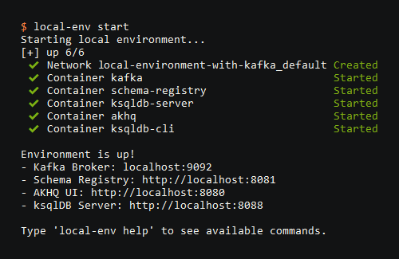
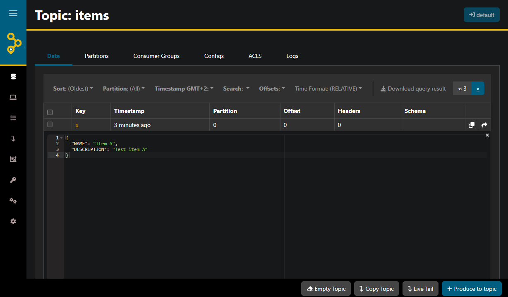
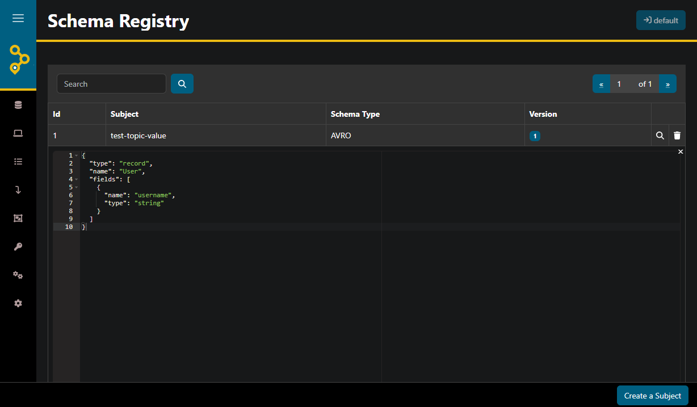
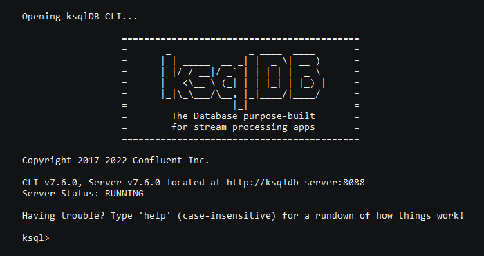

# Local Environment with Apache Kafka

This repository contains an implementation of a local development environment, featuring **Apache Kafka** running in KRaft mode, **ksqlDB**, **AKHQ**, and **Schema Registry**.
This setup is designed to help you quickly start working with Kafka, e.g., for data engineering, building microservices, developing stream processing applications, performing data analysis, or designing ETL pipelines.

<p align="center">
  
</p>

Key advantages:
* **Developer Productivity**: Lets developers start quickly while keeping consistent infrastructure across projects.
* **Simple Architecture**: Runs Kafka in KRaft mode for simpler setup, faster boots, and lower memory usage.
* **Visibility**: AKHQ provides a UI to inspect topics, manage consumer groups, and view messages.
* **Data Analysis**: ksqlDB helps you query, filter, and transform data using SQL-like syntax.
* **Schema Management**: Integrates with Schema Registry for managing Avro, Protobuf, or JSON schemas.
* **Ease of Testing**: Supports provisioning, cleanup, data seeding, with visibility of data, topics and streams.

The goal is to keep it useful, simple, clean, and easy to run.

## Quickstart

Following steps provide a quick way to get started with the environment:

1. Ensure Docker (with Docker Compose) is running on your machine, as it is required to orchestrate the containerized infrastructure.
2. Download the source code either by cloning the repository with Git or by downloading the ZIP file. If you downloaded the ZIP, extract it. Then navigate to the local-environment-with-kafka folder.
3. Start the environment in the background to run the Kafka broker, Schema Registry, ksqlDB, and AKHQ:

   **For Linux/macOS:**
    ```bash
    ./local-env start
    ```

   **For Windows:**
    ```cmd
    local-env start
    ```

4. Wait until the environment is fully initialized (you can simply use `local-env logs` for details). Then you can seed the cluster with test data:

   **For Linux/macOS:**
    ```bash
    ./local-env test-data
    ```

   **For Windows:**
    ```cmd
    local-env test-data
    ```

5. Verify that the application is running and the test data is present by opening the AKHQ UI in a web browser:
    ```console
    http://localhost:8080
    ```
   You can use this interface to visually inspect the newly created `items` topic, check active listeners, and review the stored message payloads.
6. Adjust the environment to your needs, and when you are finished, easily shut down the cluster using `./local-env stop` (or `local-env stop` on Windows) 🚀.

## Table of Contents
* [Reusable Local Environment](#reusable-local-environment)
* [Apache Kafka in Data Engineering](#apache-kafka-in-data-engineering)
* [Technology Stack](#technology-stack)
* [Deployment](#deployment)
* [Seeding Test Data](#seeding-test-data)
* [Monitoring and Management via AKHQ](#monitoring-and-management-via-akhq)
* [Managing Topics and Messages via CLI](#managing-topics-and-messages-via-cli)
* [Schema Registry for Data Contracts](#schema-registry-for-data-contracts)
* [Data Analysis with ksqlDB](#data-analysis-with-ksqldb)
* [Stop and Cleanup](#stop-and-cleanup)
* [Additional Resources](#additional-resources)
* [Author](#author)
* [Disclaimer](#disclaimer)

## Reusable Local Environment

While working with data projects, I've noticed that a reusable, modern and convenient local Kafka environment provides a nice boost to efficiency.
I also found out that starting a new data-intensive project often involves repeatedly configuring Kafka brokers (sometimes with ZooKeeper), setting up a Schema Registry, and looking for a way to test basic flows.
This environment reduces that overhead by providing a solid foundation for building stream processing applications and microservices.

To accelerate development while maintaining an industry-standard stack, the environment is preconfigured with:
* **Apache Kafka**: Runs in KRaft mode (without ZooKeeper), reducing local memory footprint and startup time.
* **Schema Registry**: Manages Avro, Protobuf, or JSON schemas to enforce strict data contracts.
* **ksqlDB**: Simplifies data analysis with intuitive SQL-like queries.
* **AKHQ**: Provides a clean web interface to easily inspect topics, messages, and consumer groups.
* **Wrapper Scripts**: Help with controlling environment and seeding test data.

It reduces repetitive setup by providing ready-to-use infrastructure, allowing developers to focus on producing, consuming, and transforming data.

## Apache Kafka in Data Engineering

Apache Kafka has become a major part of modern data engineering and works as the backbone of many event-driven systems.
Instead of relying on point-to-point integrations or traditional batch processing, it separates the systems generating data from those reading it, allowing organizations to process, route, and store massive streams of events in real-time.

Kafka provides a reliable buffer that absorbs massive data spikes so downstream systems don't crash.
Therefore, in a typical data engineering workflow, it works well with ETL (Extract, Transform, Load), real-time analytics, and event-driven architectures.
To support these workflows, the Kafka ecosystem includes powerful tools that make managing and processing data easier, such as AKHQ, Schema Registry, and ksqlDB.

This local environment lets you develop and test these workflows by running the essential components of a streaming platform directly on your machine.
Whether you are building a fraud detection system, synchronizing databases, or feeding a data lake, this environment may help you prototype and test those data flows locally.

## Technology Stack

The environment is built around the Apache Kafka ecosystem and relies on Docker Compose to orchestrate the infrastructure.
It provides a fully functional event streaming platform without the need to install anything locally other than Docker.

In summary, the stack looks as follows:
- **Streaming Platform**
    - **Apache Kafka**: Core event streaming platform configured to run in modern KRaft mode (ZooKeeper-free).
    - **Schema Registry**: Centralized service for managing and validating message schemas (Avro, Protobuf, JSON).

- **Data Analytics**
    - **ksqlDB Server**: Engine for analyzing streaming data with SQL-like syntax.
    - **ksqlDB CLI**: Interactive command-line interface to write and execute queries.

- **Observability**
    - **AKHQ**: GUI used to visually inspect Kafka topics, read message payloads, and manage consumer groups.

- **Infrastructure & Automation**
    - **Docker and Docker Compose**: Platforms used to containerize and spin up the entire cluster consistently.
    - **Bash and Batch Scripts**: Custom scripts to simplify environment lifecycle management.

## Deployment

The entire infrastructure is containerized and orchestrated using Docker Compose.
To make managing the lifecycle of the environment easier, this repository includes `local-env` scripts.
These wrapper scripts help you quickly start services, seed test data, view logs, and more.

### Start the Environment
To start the Kafka broker, Schema Registry, ksqlDB, and AKHQ in the background, simply use the `start` command:

**For Linux/macOS:**
```bash
./local-env start
```

**For Windows:**
```cmd
local-env start
```

You should see a confirmation that the environment started successfully, along with the local endpoints for your services:
* Kafka Broker: `localhost:9092`
* Schema Registry: `http://localhost:8081`
* AKHQ UI: `http://localhost:8080`
* ksqlDB Server: `http://localhost:8088`

<p align="center">
  
  <br>
  <i>Sample output of a successful environment start</i>
</p>

The containers have been started. However, you might need to wait a bit while the cluster finishes booting up.

### Verify Services and Logs

It may take a few moments for all the services to fully initialize.
You can check the status of your containers by running:

**For Linux/macOS:**
```bash
./local-env status
```

**For Windows:**
```cmd
local-env status
```

If you need to troubleshoot or simply want to watch the components boot up in real-time, you can easily tail the logs for all services:

**For Linux/macOS:**
```bash
./local-env logs
```

**For Windows:**
```cmd
local-env logs
```

## Seeding Test Data

By default, the started Kafka cluster contains no messages, so you may want to add some test data.
To make testing easier and more efficient, this environment includes a quick way to inject sample data using the provided `loca-env` scripts.

Test data is stored in the `test-data.sql` file, which contains ksqlDB statements.
By default, it automatically creates a stream named `items` and inserts three sample records into it.

When you run the `test-data` command, the script pipes the contents of `test-data.sql` directly into the `ksqldb-cli` container, executing the queries on the `ksqldb-server`.

To seed the environment with test data, **wait until the environment is fully initialized**, then run the following command:

**For Linux/macOS:**
```bash
./local-env test-data
```

**For Windows:**
```cmd
local-env test-data
```

Once the script completes successfully, you can easily verify that the messages were published to your cluster, e.g. by using AKHQ.
To do so, simply open your browser and navigate to `http://localhost:8080` to visually inspect the newly created items topic and view the message payloads.

## Monitoring and Management via AKHQ

AKHQ provides a web-based user interface that helps developers view and manage Kafka clusters in simple and convenient way.
It offers a convenient way to observe cluster activity, produce test messages, check active listeners, and review stored data.
AKHQ is already integrated into this environment's Docker Compose setup, so it connects directly to the Kafka broker and Schema Registry.

To open the interface, navigate to `http://localhost:8080` in your web browser.

Once open, the dashboard gives you a unified view of your local environment:
* **Topic Management:** View a complete list of topics, check partition layouts, inspect replication details, create new topics, or modify existing configurations.
* **Data Browsing:** Inspect real-time message payloads, keys, timestamps, and headers inside any topic. If you are using Schema Registry, AKHQ automatically handles message deserialization.
* **Consumer Groups:** Monitor active consumer groups, track consumer lag across partitions, and review offset assignments.
* **Schema Registry:** Explore registered schemas, check version history, and validate compatibility rules directly through the UI.

As an example, here is a quick glimpse of how the AKHQ interface displays messages:

<p align="center">
  
  <br>
  <i>Sample AKHQ Data view. For more information about AKHQ please visit <a href="https://akhq.io/">akhq.io</a>.</i>
</p>


Having a clear view of your topics and messages makes testing and debugging significantly easier.

## Managing Topics and Messages via CLI

While AKHQ provides a convenient web UI for interacting with a cluster, you sometimes might prefer to use command-line tools.
Since the Kafka broker is running in a `kafka` Docker container, you can access such tools using `docker exec`.

Here are a few simple commands you can run directly from your terminal.

**List all topics:**
```bash
docker exec -it kafka kafka-topics --bootstrap-server localhost:9092 --list
```

**Create a new topic:**
```bash
docker exec -it kafka kafka-topics --bootstrap-server localhost:9092 --create --topic my-new-topic --partitions 1 --replication-factor 1
```

**Describe a topic:**
```bash
docker exec -it kafka kafka-topics --bootstrap-server localhost:9092 --describe --topic my-new-topic
```

You can also send and read raw messages directly from the terminal using the built-in console clients.

**Produce messages to a topic:**
```bash
docker exec -it kafka kafka-console-producer --bootstrap-server localhost:9092 --topic my-new-topic
```

> (Once the prompt opens, type a message and press Enter. Press `Ctrl+C` to exit.)

**Consume messages from a topic:**
```bash
docker exec -it kafka kafka-console-consumer --bootstrap-server localhost:9092 --topic my-new-topic --from-beginning
```

## Schema Registry for Data Contracts

In modern architectures, establishing clear data contracts helps producers and consumers agree on how messages are structured.
The Schema Registry acts as a centralized service to manage and validate such message schemas, which supports maintaining high data quality across pipelines.

Within this local development environment, the Schema Registry:
* allows you to manage Avro, Protobuf, or JSON schemas to enforce strict data contracts
* exposes an API for local development accessible at `http://localhost:8081`
* connects directly to the local Kafka broker internally
* is integrated with the AKHQ

The AKHQ UI helps you explore registered schemas, check version history, and validate compatibility rules directly.
Instead of interacting with the underlying Schema Registry API, you can manage your contracts visually.

To access the AKHQ Schema Registry view, simply visit `http://localhost:8080/ui/local-kafka/schema`:


<p align="center">
  
  <br>
  <i>Sample AKHQ Schema Registry view. For more information about AKHQ please visit <a href="https://akhq.io/">akhq.io</a>.</i>
</p>


However, if you prefer working with the underlying Schema Registry API, it is available at `http://localhost:8081`.

For example, you can create a simple schema like this:
```bash
curl -X POST -H "Content-Type: application/vnd.schemaregistry.v1+json" \
  --data '{"schema": "{\"type\":\"record\",\"name\":\"User\",\"fields\":[{\"name\":\"username\",\"type\":\"string\"}]}"}' \
  http://localhost:8081/subjects/test-topic-value/versions
```

You can then use `http://localhost:8081` API to list subjects:
```bash
 curl http://localhost:8081/subjects
```
```json
["test-topic-value"]
```

To get more information about the `test-topic-value` schema, you can use:
```bash
curl http://localhost:8081/subjects/test-topic-value/versions/latest
```
```json
{
  "subject": "test-topic-value",
  "version": 1,
  "id": 1,
  "schema": "{\"type\":\"record\",\"name\":\"User\",\"fields\":[{\"name\":\"username\",\"type\":\"string\"}]}"
}
```

This combination of the Schema Registry, visual management, and direct API access makes it easy to enforce and test data contracts locally.

## Data Analysis with ksqlDB

With ksqlDB, you can analyze data using a familiar, SQL-like syntax.
Instead of writing custom Java or Scala code with Kafka Streams, you can filter, transform, aggregate, and join real-time data streams declaratively.
You can also use good old tables 🙂

In this environment, ksqlDB Server and the interactive CLI come pre-configured out of the box.

You can start an interactive ksqlDB CLI session using the provided `local-env` script:

**For Linux/macOS:**
```bash
./local-env ksql
```

**For Windows:**
```cmd
local-env ksql
```

Once connected, you will see the ksqlDB prompt:

<p align="center">
  
  <br>
  <i>Welcome screen of ksqlDB CLI. For more information about ksqlDB please visit <a href="https://docs.confluent.io/platform/current/ksqldb/overview.html">docs.confluent.io</a>.</i>
</p>


If you already [seeded test data](#seeding-test-data) (`test-data` command), ksqlDB will already have the items stream defined.

You can easily list available topics:
```sql
SHOW TOPICS;
```
```console
 Kafka Topic                 | Partitions | Partition Replicas
---------------------------------------------------------------
 default_ksql_processing_log | 1          | 1
 items                       | 1          | 1
---------------------------------------------------------------
```

You can also see available streams:
```sql
SHOW STREAMS;
```
```console
 Stream Name         | Kafka Topic                 | Key Format | Value Format | Windowed
------------------------------------------------------------------------------------------
 ITEMS               | items                       | KAFKA      | JSON         | false
 KSQL_PROCESSING_LOG | default_ksql_processing_log | KAFKA      | JSON         | false
------------------------------------------------------------------------------------------
```

If you would like to inspect the schema and metadata of the items stream, you can simply do it like this:
```sql
DESCRIBE items;
```
```console
Name                 : ITEMS
 Field       | Type
--------------------------------------
 ID          | VARCHAR(STRING)  (key)
 NAME        | VARCHAR(STRING)
 DESCRIPTION | VARCHAR(STRING)
--------------------------------------
```

Things are getting more interesting, when you want to check actual data. You can see arriving records like this:
```sql
SELECT * FROM items EMIT CHANGES;
```

To read all records from the beginning you can set `auto.offset.reset` to `earliest`, as follows.
```sql
SET 'auto.offset.reset' = 'earliest';
SELECT * FROM items EMIT CHANGES;
```

You can also use other SQL commands, e.g. `WHERE`, to adjust queries to your needs:
```sql
SELECT * FROM items WHERE name='Item A' EMIT CHANGES;
```

```console
+---------------+---------------+---------------+
|ID             |NAME           |DESCRIPTION    |
+---------------+---------------+---------------+
|1              |Item A         |Test item A    |
```

I like streams for analyzing event logs, but usually I'm more interested in the current state, which is where tables come in.
They basically let you see a constantly updated snapshot of your data.
Therefore, I think tables are very convenient from a data analyst perspective.

In practice, you can easily aggregate stream data into a table like this:
```sql
CREATE TABLE items_table AS
    SELECT id,
       LATEST_BY_OFFSET(name) AS latest_name,
       LATEST_BY_OFFSET(description) AS latest_description
    FROM items
    GROUP BY id;
```

Then, you can query it, using SQL-like syntax:
```sql
SELECT * FROM items_table WHERE id = '1';
```
```console
+-------------------+-------------------+-------------------+
|ID                 |LATEST_NAME        |LATEST_DESCRIPTION |
+-------------------+-------------------+-------------------+
|1                  |Item A             |Test item A        |
```

You can also apply transformations. For example, you can format a stream and output it to a new Kafka topic:
```sql
CREATE STREAM items_uppercase AS
    SELECT
        id,
        UCASE(name) AS name_upper,
        description
    FROM items
    EMIT CHANGES;
```

Or you can do it when creating tables. For example, here is a simple count:
```sql
CREATE TABLE item_counts AS
    SELECT
        name,
        COUNT(*) AS total_count
    FROM items
    GROUP BY name
    EMIT CHANGES;
```

To exit ksqlDB simply type:
```sql
EXIT;
```

## Stop and Cleanup

When you have finished working with the environment, you can shut it down using the provided `local-env` scripts.

If you want to stop the containers, use the `stop` command:

**For Linux/macOS:**
```bash
./local-env stop
```

**For Windows:**
```cmd
local-env stop
```

If you want to completely tear down the infrastructure and remove associated data (such as topics and schemas), use the `clean` command.
This stops the environment and deletes the data volumes.

**For Linux/macOS:**
```bash
./local-env clean
```

**For Windows:**
```cmd
local-env clean
```

Simple as that, you can stop containers or clean the environment to start fresh next time.

## Additional Resources

* [Apache Kafka Documentation](https://kafka.apache.org/documentation/)
* [KRaft: Apache Kafka Without ZooKeeper](https://developer.confluent.io/learn/kraft/)
* [ksqlDB Documentation](https://docs.confluent.io/platform/current/ksqldb/overview.html)
* [AKHQ - Kafka GUI for Apache Kafka](https://akhq.io/)
* [Schema Registry for Confluent Platform](https://docs.confluent.io/platform/current/schema-registry/index.html)
* [ksqlDB - Database Streaming FAQs](https://developer.confluent.io/faq/apache-kafka/ksqldb/)

## Author
This project was created by [Kamil Mazurek](https://kamilmazurek.pl), a Software Engineer based in Warsaw, Poland.
You can also find me on my [LinkedIn profile](https://www.linkedin.com/in/kamil-mazurek).

More of my repositories can also be found on my GitHub and GitLab profiles:
- [Kamil Mazurek on GitHub](https://github.com/kamilmazurek)
- [Kamil Mazurek on GitLab](https://gitlab.com/kamilmazurek)

Thanks for visiting 🙂

## Disclaimer

THIS SOFTWARE AND ANY DOCUMENTATION INCLUDED IN THIS REPOSITORY AND CREATED BY THE AUTHOR
(INCLUDING, BUT NOT LIMITED TO, THE README.MD FILE) ARE PROVIDED FOR EDUCATIONAL PURPOSES ONLY.

THE SOFTWARE AND DOCUMENTATION ARE PROVIDED "AS IS", WITHOUT WARRANTY OF ANY KIND, EXPRESS OR IMPLIED,
INCLUDING BUT NOT LIMITED TO THE WARRANTIES OF MERCHANTABILITY, FITNESS FOR A PARTICULAR PURPOSE AND NONINFRINGEMENT.
IN NO EVENT SHALL THE AUTHORS OR COPYRIGHT HOLDERS BE LIABLE FOR ANY CLAIM, DAMAGES OR OTHER LIABILITY,
WHETHER IN AN ACTION OF CONTRACT, TORT OR OTHERWISE, ARISING FROM, OUT OF OR IN CONNECTION WITH THE SOFTWARE,
THE DOCUMENTATION, OR THE USE OR OTHER DEALINGS IN THE SOFTWARE OR DOCUMENTATION.

THIRD-PARTY LIBRARIES REFERENCED OR INCLUDED IN THIS SOFTWARE ARE SUBJECT TO THEIR OWN LICENSES.
THIRD-PARTY DOCUMENTATION OR EXTERNAL RESOURCES REFERENCED IN THIS REPOSITORY ARE SUBJECT TO THEIR OWN LICENSES AND TERMS.

Apache Kafka is a trademark of the Apache Software Foundation. Docker is a trademark or registered trademark of Docker, Inc.
ksqlDB is trademark of Confluent, Inc. AKHQ, Schema Registry and other names may be trademarks of their respective owners.